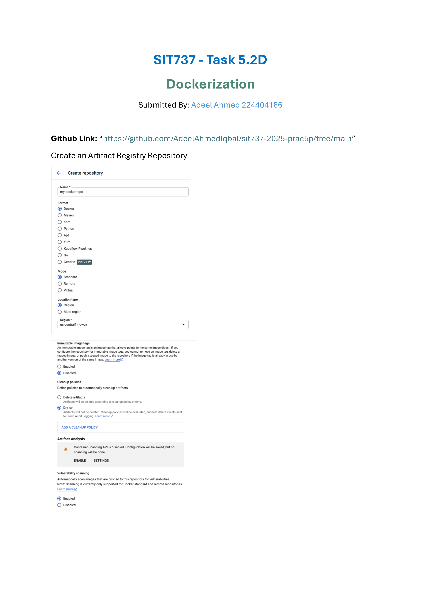
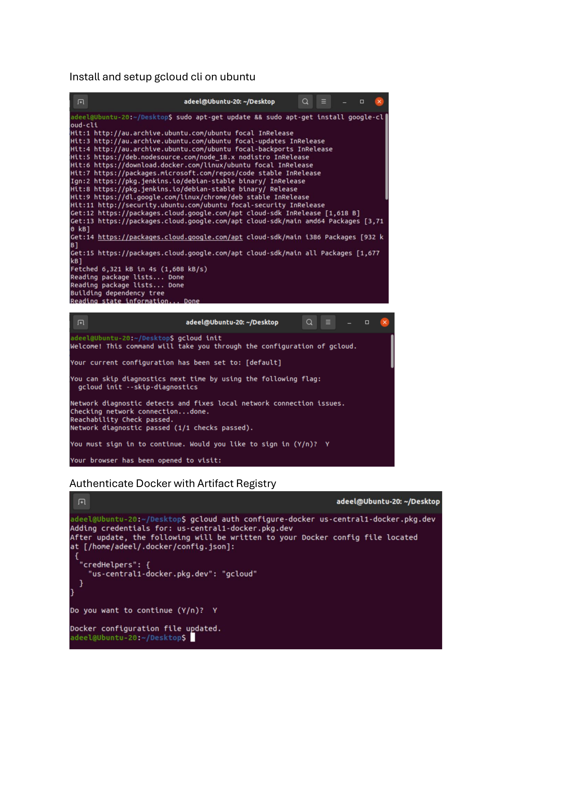
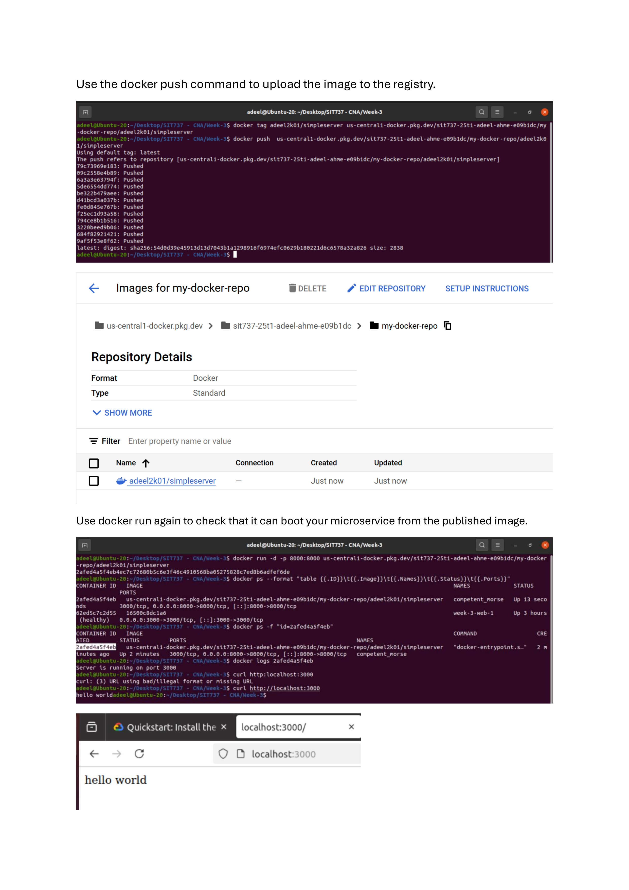

# SIT737 - Task 5.2D: Dockerization

**Submitted By:** Adeel Ahmed (224404186)  

## Overview

The following represent the steps and outcomes of Dockerizing a microservice for SIT737 Task 5.2D.

### 📄 Page 1

### 📄 Page 2

### 📄 Page 3

## Conclusion

Refer to the images above for complete process of dockerizing a microservice and publishing the Docker image to a Google Cloud Artifact Registry repository. The process includes creating the repository, setting up the gcloud CLI, authenticating Docker, pushing the image, and running the container to confirm successful deployment.
